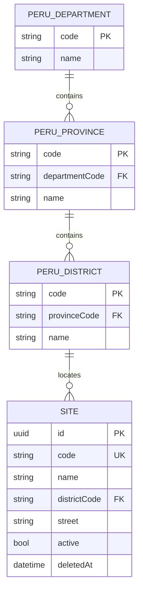

# Peru geography and site model

```mermaid
erDiagram
    PERU_DEPARTMENT ||--o{ PERU_PROVINCE : contains
    PERU_PROVINCE ||--o{ PERU_DISTRICT : contains
    PERU_DISTRICT ||--o{ SITE : locates

    PERU_DEPARTMENT {
        string code PK
        string name
    }
    PERU_PROVINCE {
        string code PK
        string departmentCode FK
        string name
    }
    PERU_DISTRICT {
        string code PK
        string provinceCode FK
        string name
    }
    SITE {
        uuid id PK
        string code UK
        string name
        string districtCode FK
        string street
        bool active
        datetime deletedAt
    }
```

`Site.districtCode` is the only geographical foreign key. Department and province
are derived through the relationship, preventing inconsistent combinations.
